# Car Comparision Module

## HLD - High Level Design

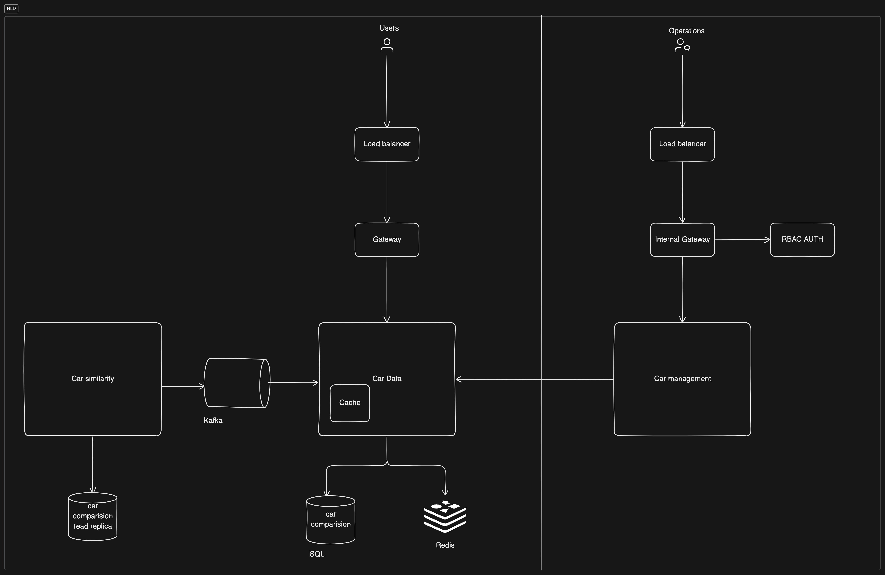

## ERD - Entity Relationship Diagram

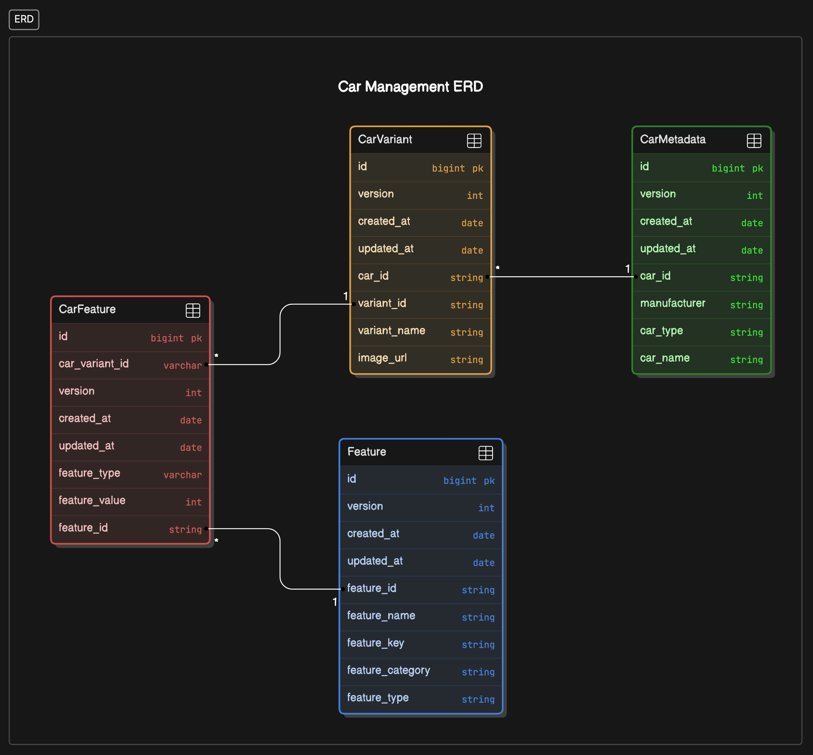

## Sequence diagrams

### Add Car
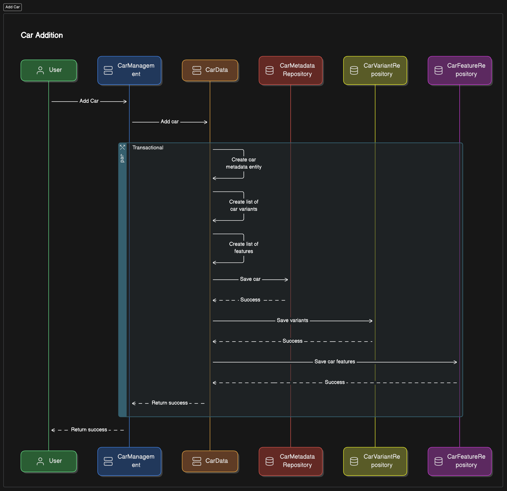

### Add car variant
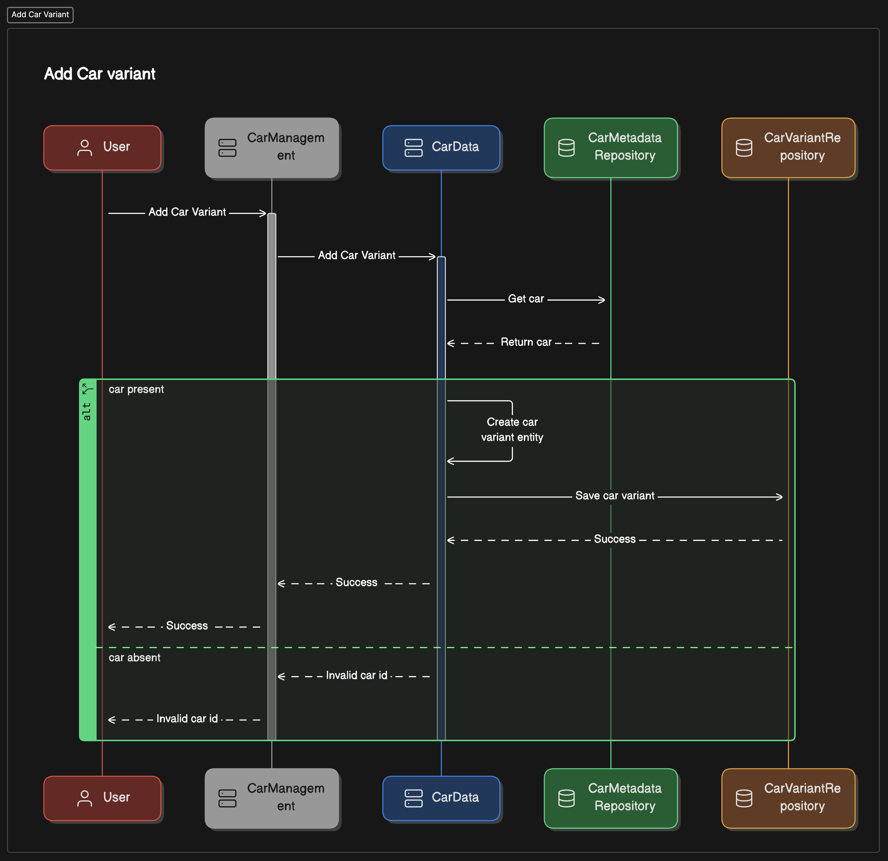

### Add Feature
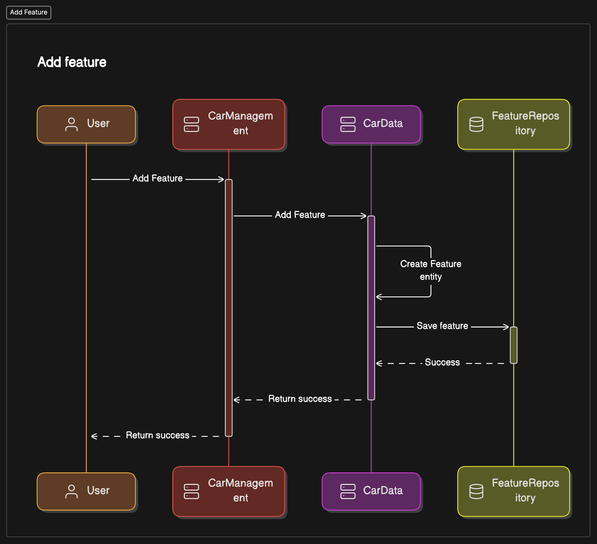

### Add Car Feature
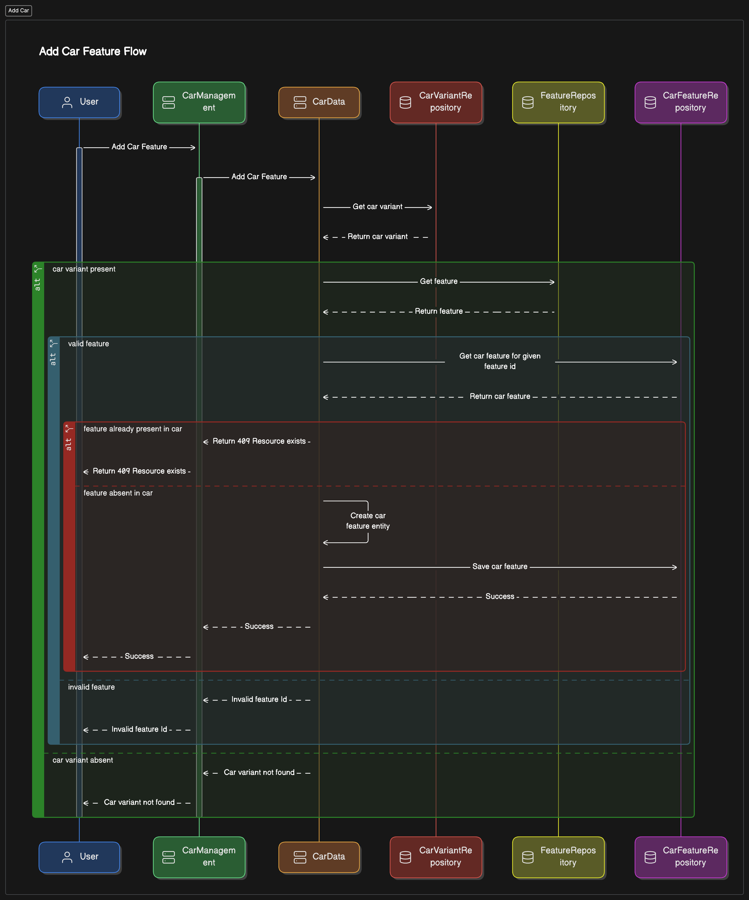

### Cache
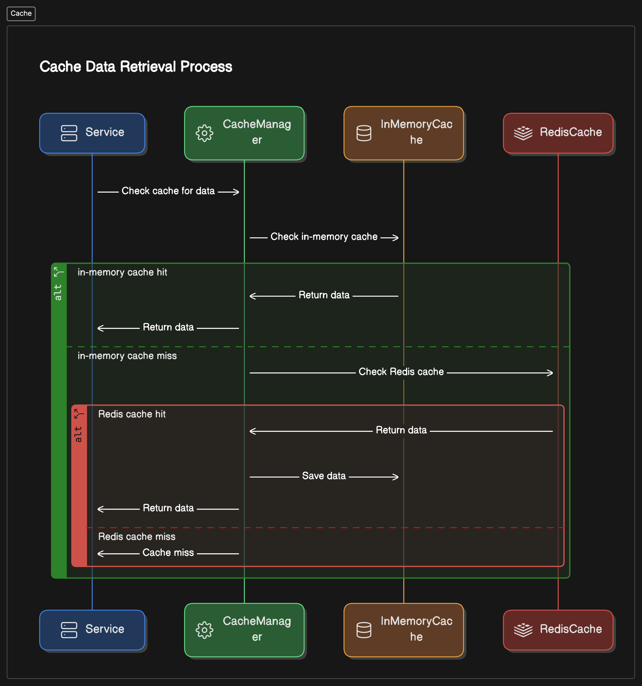

### Get Car
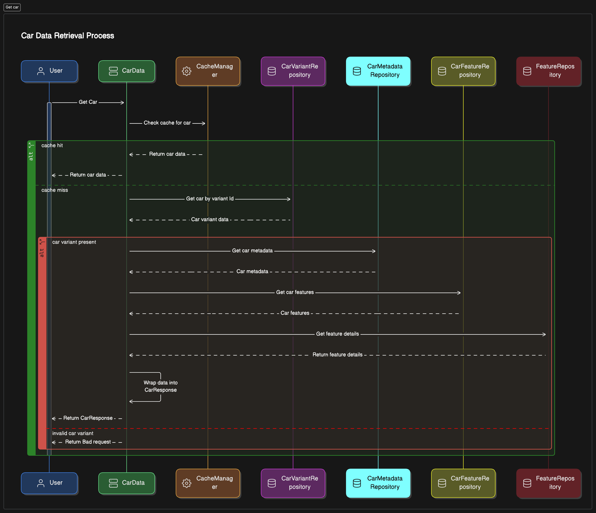

###  
### Car differences
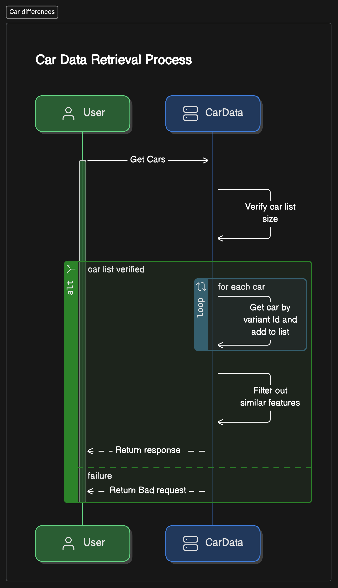

### Multiple cars
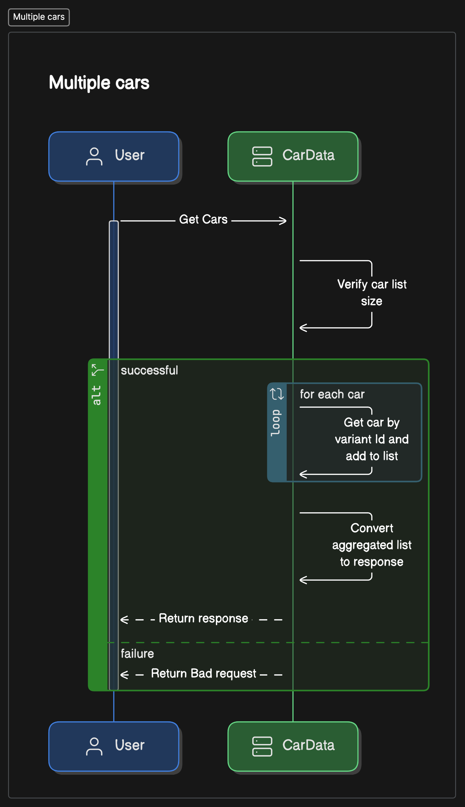

### Car Similarity
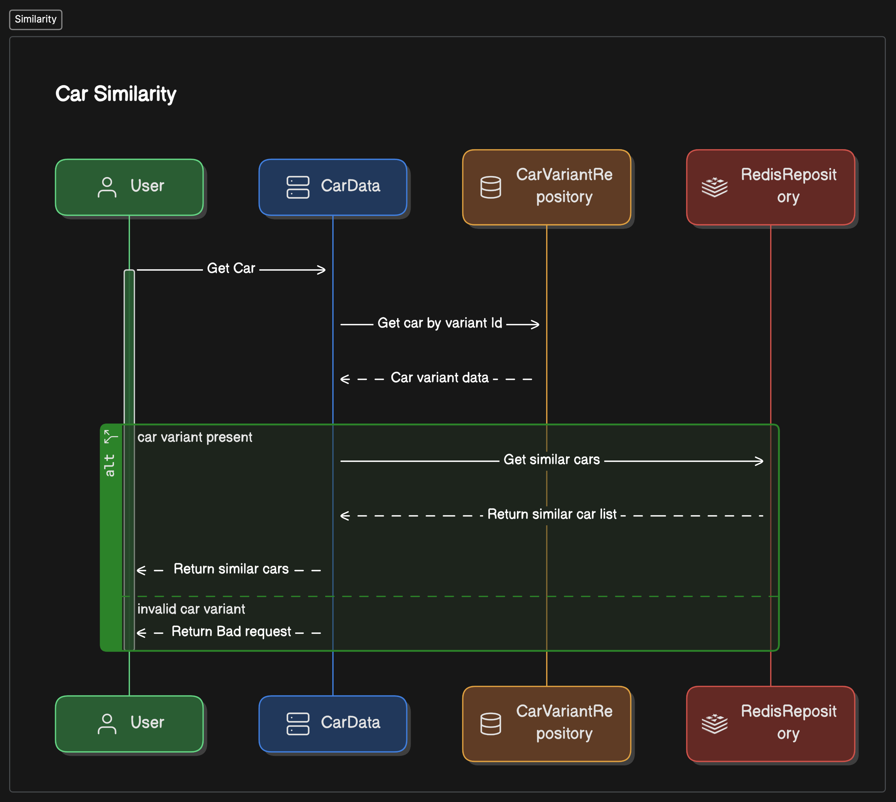

## 

## 

