# Car Comparision Module

## Assumptions and Calculations

1. According to various sources like Wikipedia, [teoalida.com](https://teoalida.com/), [autoevolution.com ](https://autoevolution.com/) theres approximately a total of ~8000 models and around ~50000 engine variations with around 220 manufacturers in the world.
2. On average, every year we see a total 3000-5000 new engine variations added.
3. Sizes -
  1. Car Feature Entity - 180 bytes - Total: ~ **300 MB** (Assuming 15 features per variant, with 100k variants)
  2. Car Variant Entity - 310 bytes - Total : ~ **30 MB** (Assuming 100,000 variants, twice of current estimates)
  3. Feature Entity - 250 bytes - Total < **1 MB **(There wont be too many independent features)
  4. Car Metadata Entity - 250 bytes - Total: **2 MB** (6000 x 250 / (1024 x 1024))
4. Since the total amount of data is not very high, a well indexed and optimized SQL instance should be able to handle the load.

### Out of Scope
1. Currently, any car search module is not included in the HLD.
2. RBAC Auth is not implemented in the code, a much simpler HTTP basic auth is used for demonstration purposes.
3. Frontend is not included.

## HLD - High Level Design

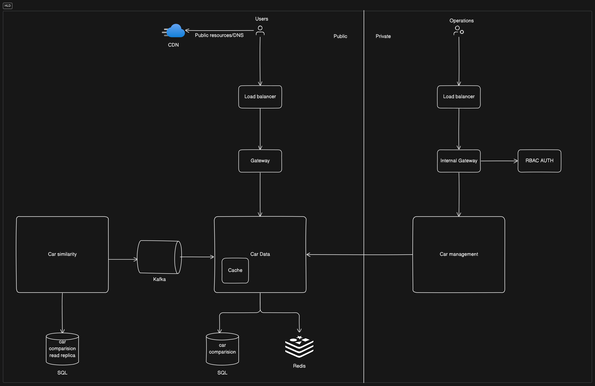

## ERD - Entity Relationship Diagram

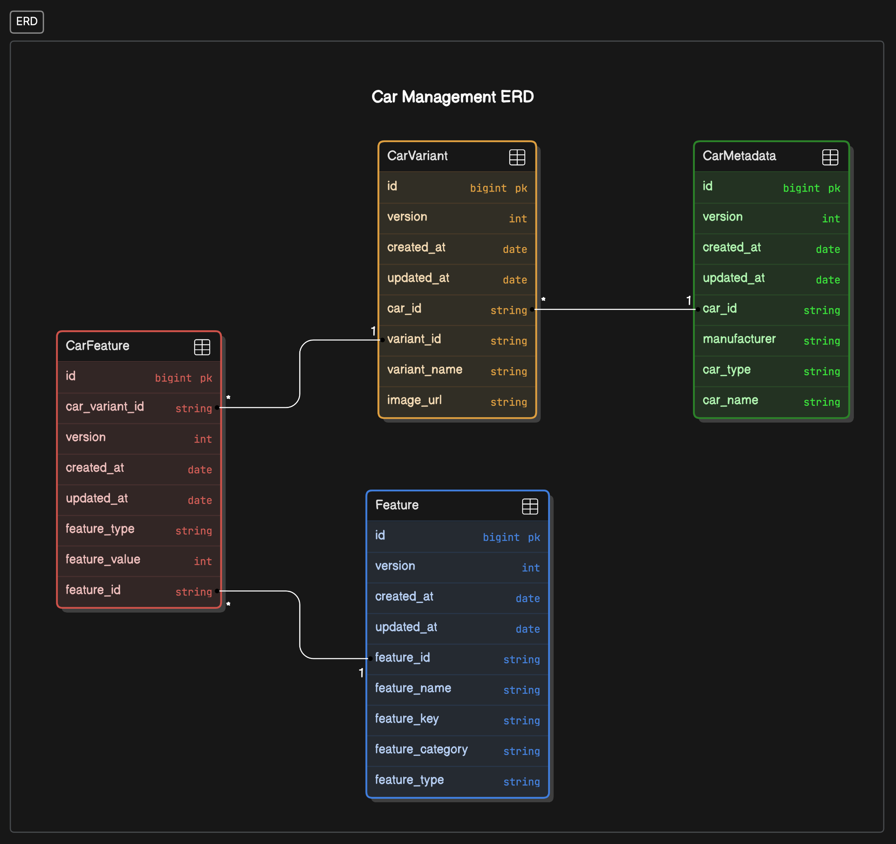

## Entity Information

#### 1. Car Feature 
- Indexes
    - car_variant_id
    - feature_id
- Unique constraints
    - Composite of car_variant_id and feature_id
#### 2.Car Variant
- Indexes
    - car_id
    - variant_id
- Unique constraints
    - variant_id
#### 3.Car Metadata
- Indexes
    - car_type
- Unique constraints
    - car_id
#### 4.Feature
- Indexes
    - feature_id
- Unique constraints
    - feature_id

## Sequence diagrams

### Add Car - POST - `/v1/api/management/car`
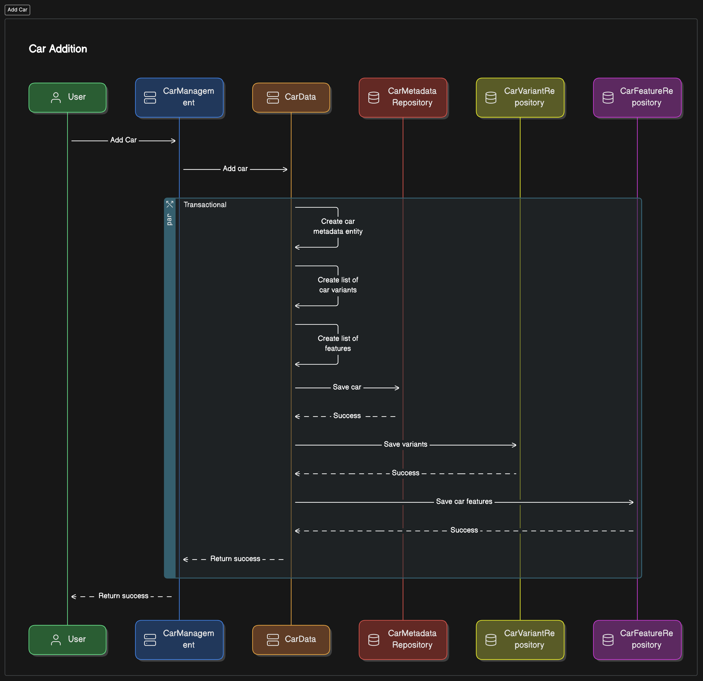

### Add car variant - POST - `/v1/api/management/car/variant/{carId}`
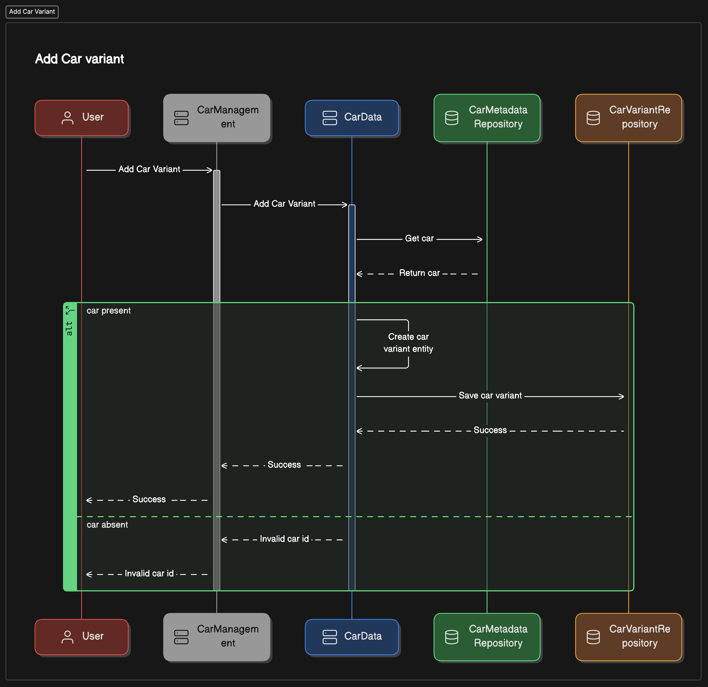

### Add Feature - POST - `/v1/api/management/feature`
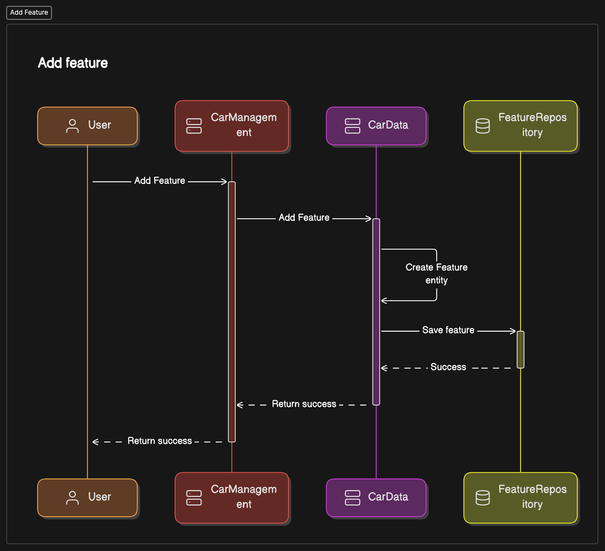

### Add Car Feature - `/v1/api/management/car/feature/{carVariantId}`
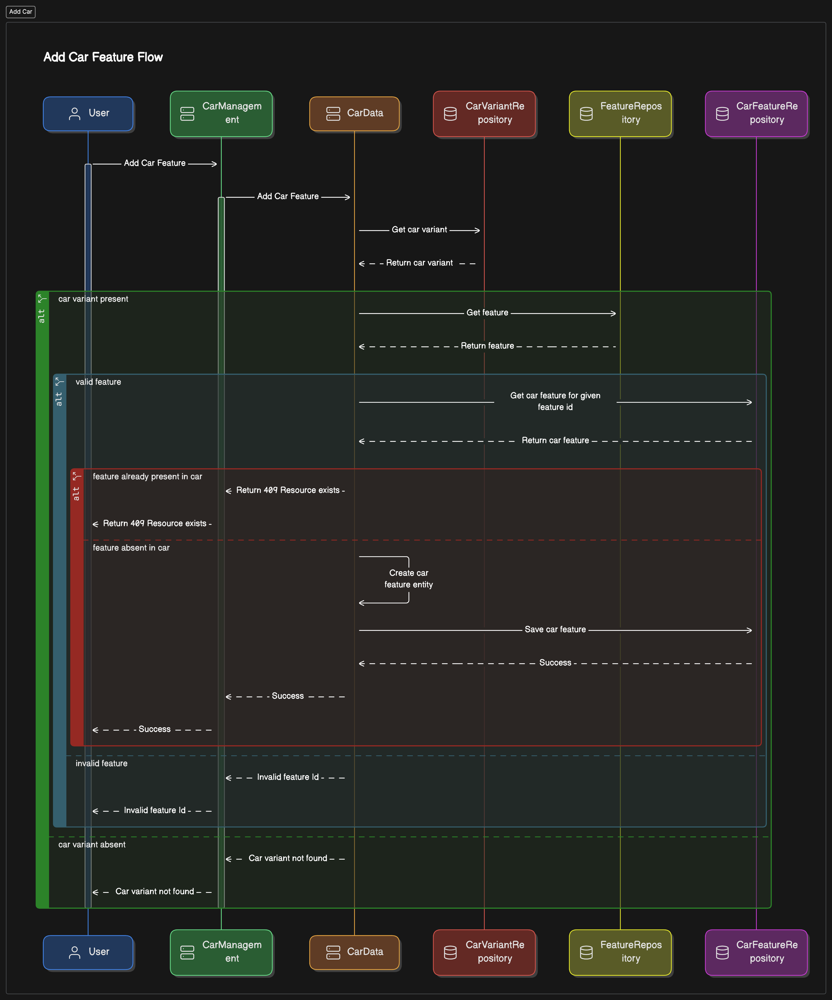

### Cache
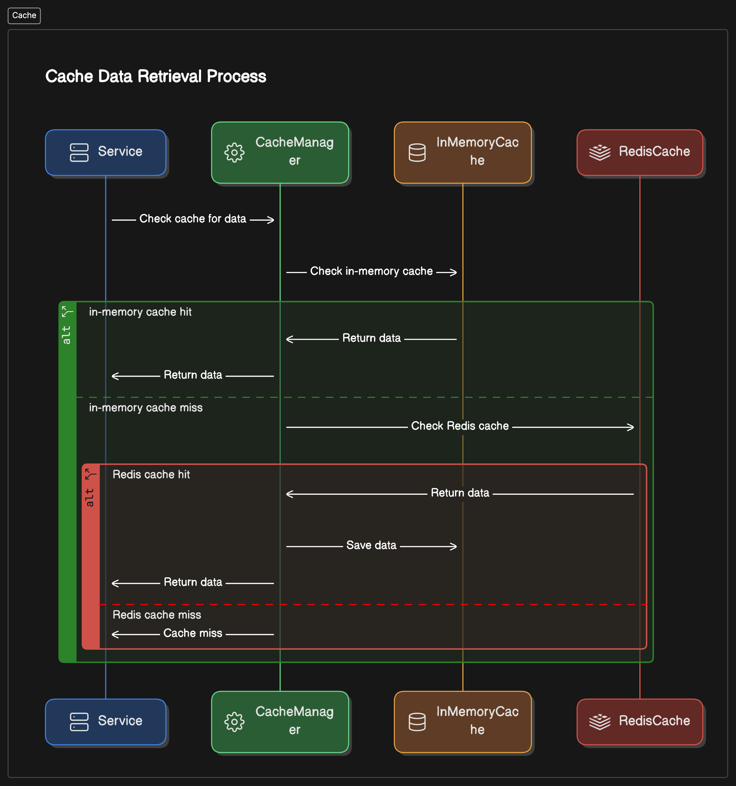

### Get Car - GET - `/v1/api/car/{carVariantId}`
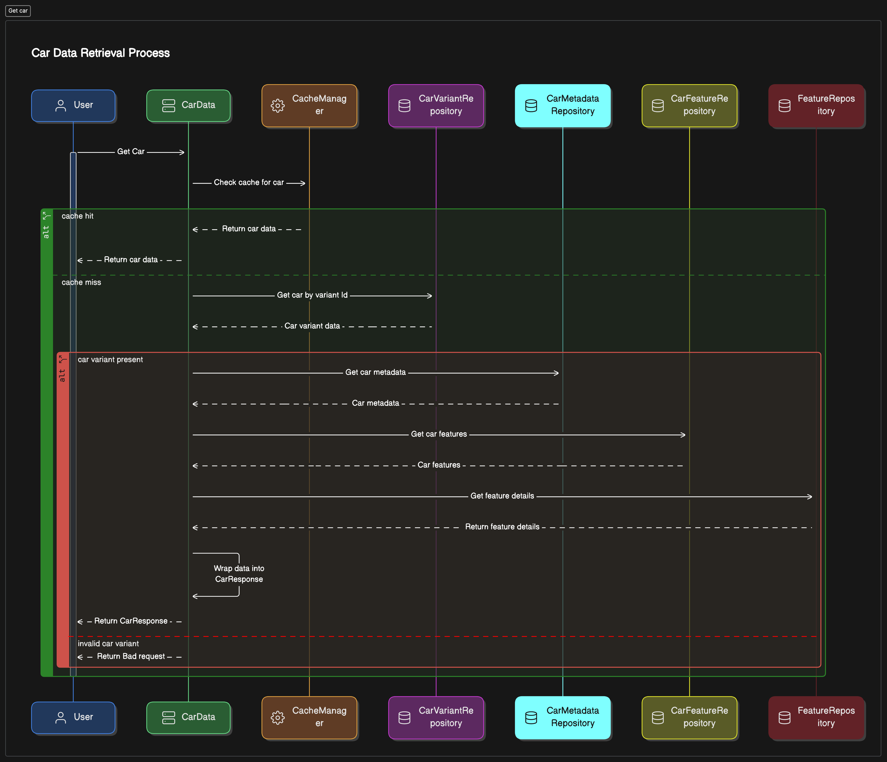

###  
### Car differences - POST - `/v1/api/car/compare/differences`
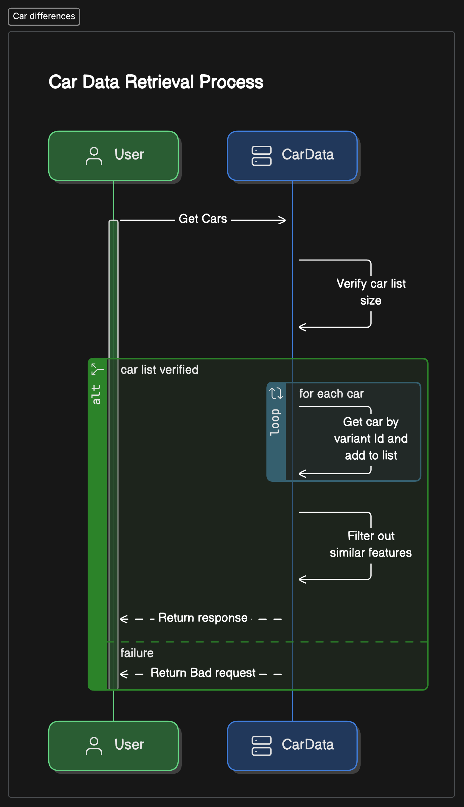

### Multiple cars - POST - `/v1/api/car/compare`
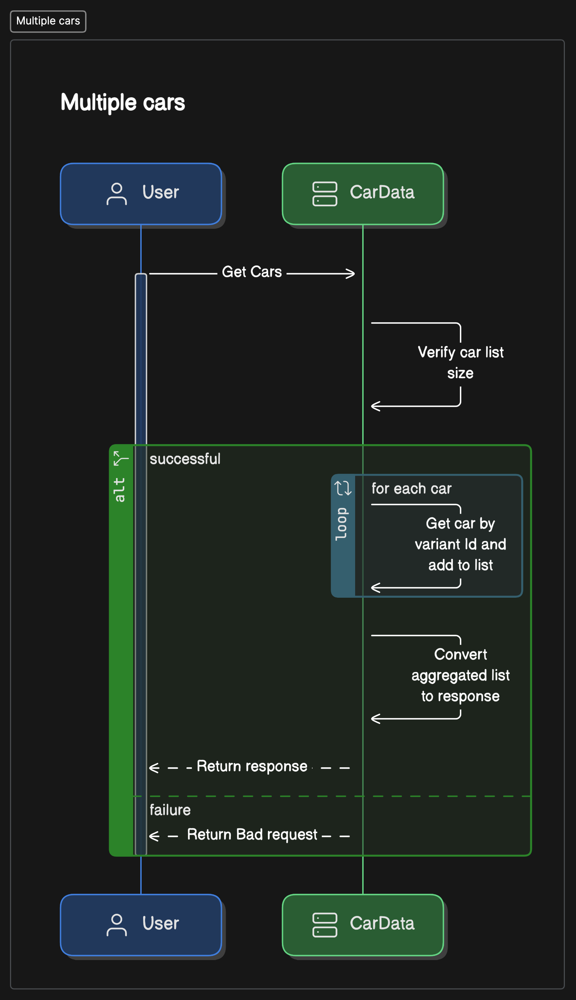

### Car Similarity - GET - `/v1/api/car/similar/{carVariantId}`
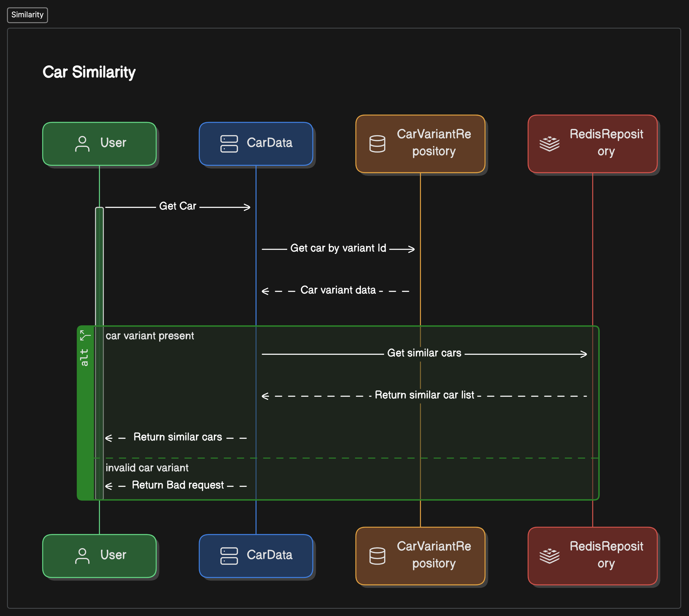

### Similarity Cron
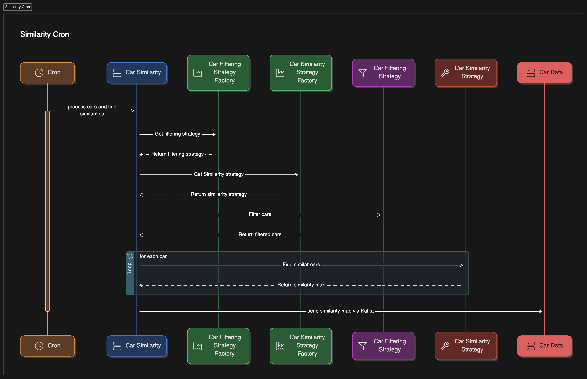

## 

## 

